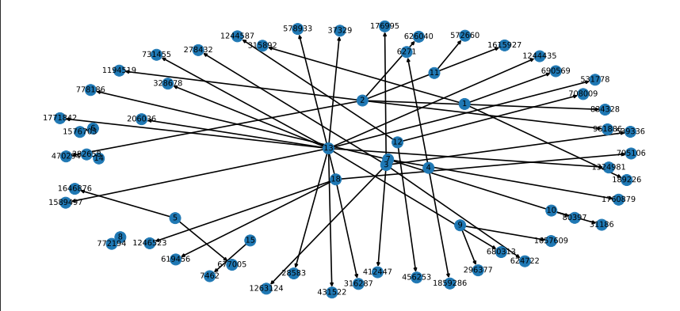

# Facebook-Friend-Recommender

Download tranin.csv from https://www.kaggle.com/competitions/FacebookRecruiting/data

#### Problem Statement:
We have to predict missing links to recommend users (Link Prediction) from a given directed graph.
 
Link prediction is the task to predict the missing links in graphs. it is mainly used in Social nerworks and Recomender systems

## Sample graph of the dataset

The dataset contains 1862220 unique nodes (or users) and 9437519 edges .Edges indicate relationship between two nodes  A->B means A is following B ( since the graph is directed we have assumed this ) 

### Buissness Constraints:
  #### Run Time Complexity : 
  The model doesnt need to return results in real time since the recomended users or friends can be calculated beforehand and stored
  #### Cost of errors :
  The cost of errors is not high
  #### Evaluation metric: F1 score 
  F1 score is defined as the harmonic mean between precision and recall. It is used as a statistical measure to rate performance.
  
  
  
  
### Posing problem as Classification Problem
Given two userid we will classify them into 2 classes (binary classification)

class 0: Link doesnt exist

class 1: Link does exist

The dataset already have class 1 data points. So we have to generate data points for class 0.

### Featurizing the dataset
There are bunch of features that could be used for graph data .Out of which in this  project we have used 
* Jaccard Distance
* Cosine Distance
* Page Ranking
* Shortest Path
* Adar Index
* Following back
* Katz Centrality
* Hits Score
* Number of followers
* Number of followees
* Intersection of followers
* Intersection of followees
* Eigen Vector Centrality
* Clustring Coefficient

### Models Trained:
* Logistic Regression
* SVM
* Random Forest

